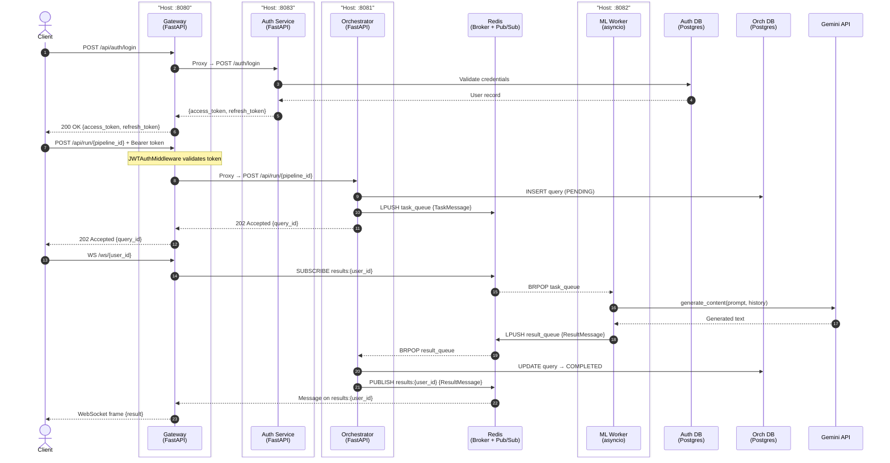
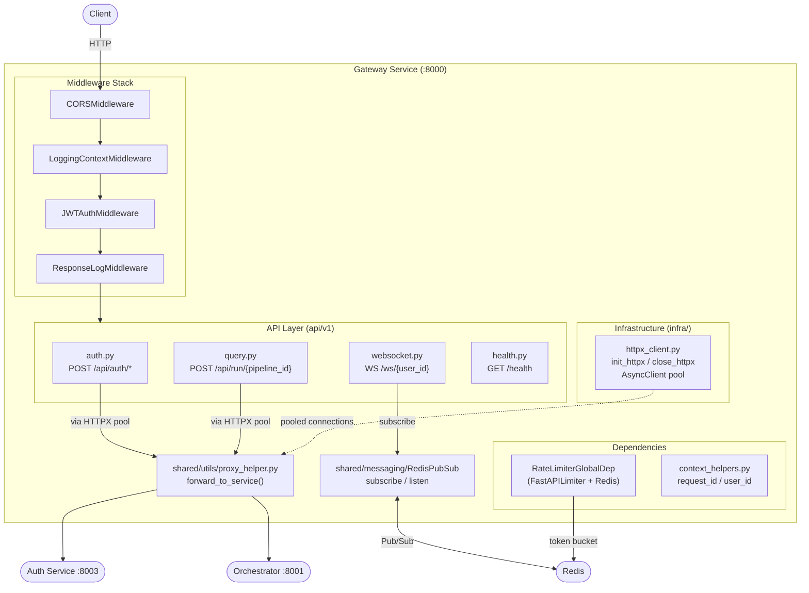
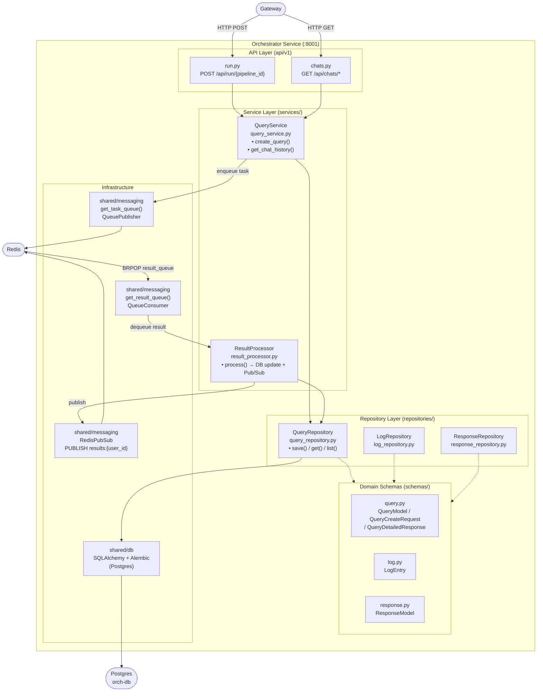
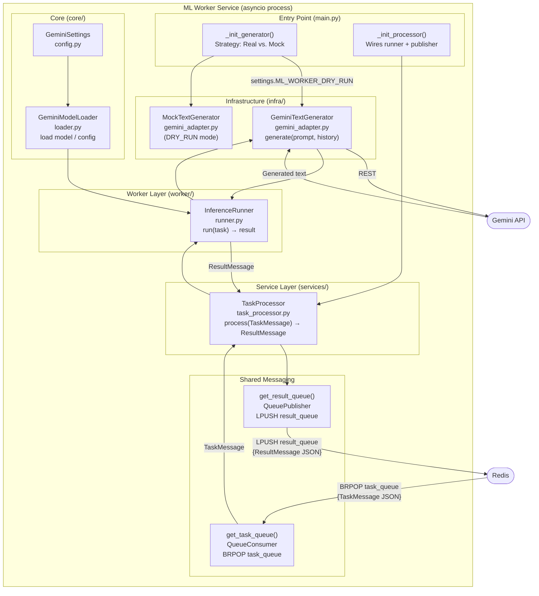
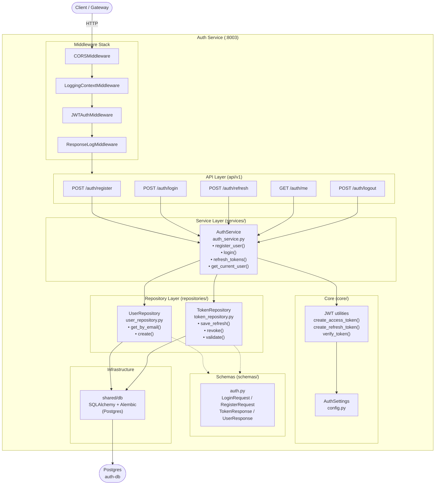
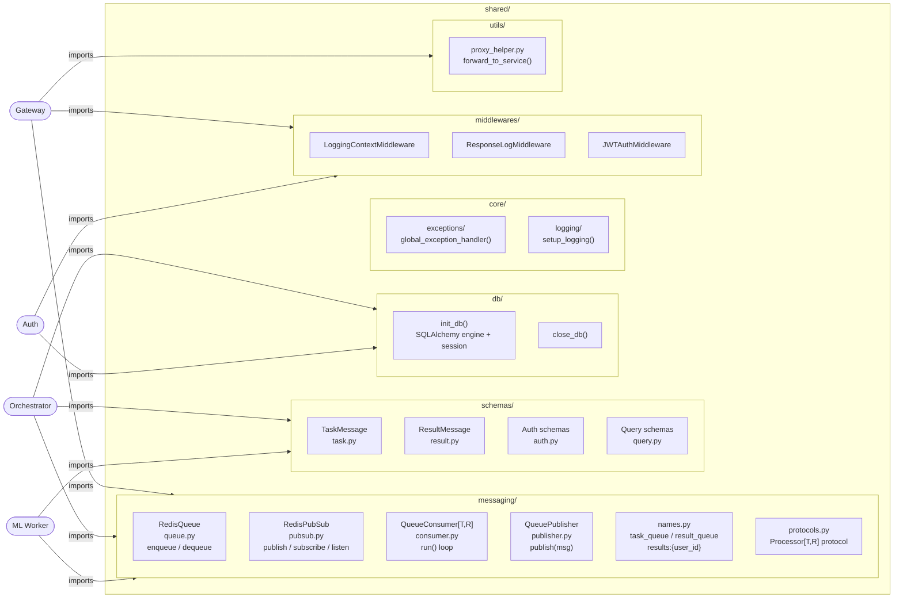

# UML Diagrams — ML Microservices

---

| # | Diagram                        | Type                                                                                                                                                           |
|---|--------------------------------|----------------------------------------------------------------------------------------------------------------------------------------------------------------|
| 1 | **Global System Architecture** | Sequence diagram — full request lifecycle: auth → task submit → Redis queue → ML Worker → result consumer → WebSocket delivery                                 |
| 2 | **Gateway Service**            | Component graph — middleware stack, API routes (auth/query/websocket/health), HTTPX pool, rate limiter, Redis Pub/Sub bridge                                   |
| 3 | **Orchestrator Service**       | Layered component graph — API → Services (`QueryService`, `ResultProcessor`) → Repositories (`Query`, `Log`, `Response`) → DB + Redis queues                   |
| 4 | **ML Worker Service**          | Process/component graph — strategy pattern for generator init, `InferenceRunner`, `TaskProcessor`, `GeminiTextGenerator`/Mock, queue consumer/publisher wiring |
| 5 | **Auth Service**               | Component graph — middleware stack, all auth endpoints, `AuthService`, `UserRepository`, `TokenRepository`, JWT utilities, Postgres                            |
| 6 | **Shared Library**             | Dependency graph — shows which shared components (`messaging`, `schemas`, `db`, `middlewares`, `utils`) each service imports                                   |

## 1. Global System Architecture

End-to-end data flow from client to result delivery.

---

## 2. Gateway Service

---

## 3. Orchestrator Service

---

## 4. ML Worker Service

---

## 5. Auth Service

---

## 6. Shared Library Components

